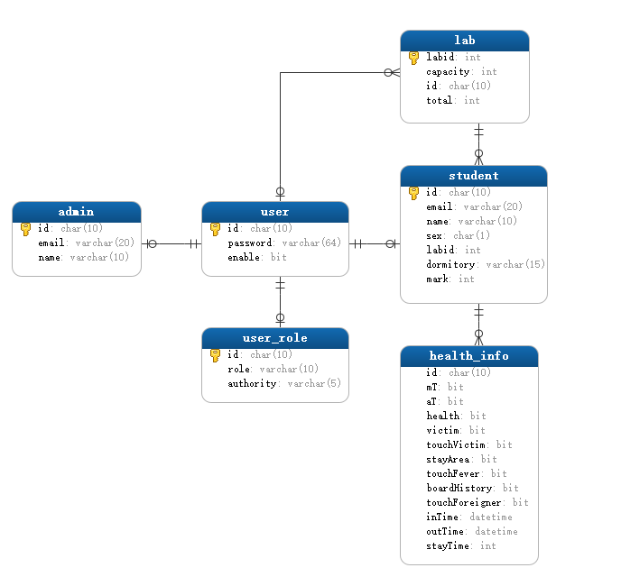
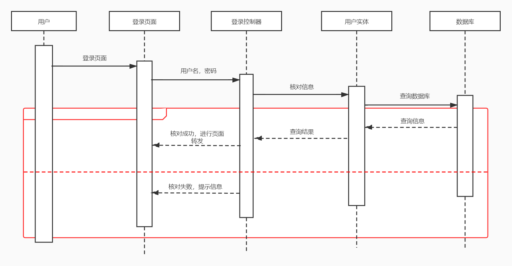

# 数据库课程设计

[TOC]


## 概述

### 项目背景

疫情期间学生进实验室之前需要扫码登记相关健康信息，开发一套适用于健康登记登出的系统.

### 编写目的

疫情期间学生进实验室之前需要扫码登记相关健康信息，开发一套适用于健康登记登出的系统.达到掌握基本的数据库设计流程。充实理论课所学的；理论知识。完成课程实践。

### 开发环境

+ 数据库： **MySQL  8.0.17**
+ 代理服务器：Nginx
+ 数据库缓存：Redis
+ 开发环境： Windows 10
+ 编程语言： **Java 1.8.0_144**
+ Web服务器：Undertow 2.0.30
+ 数据库连接池：**HikariCP 3.4.2**
+ 持久层框架：**Mybatis 3.4.0**
+ Web核心框架：SpringBoot 2.2.6
+ Web安全框架：Spring Security 5.1.0 
+ 前端模板引擎：Thymeleaf  2.1.6 
+ 前端框架：Bootstrap  3.3.7
+ 图表：Echarts 4.1.0

## 需求分析

### 问题描述

疫情期间学生进实验室之前需要扫码登记相关健康信息，如有发热应自动提示学生按规范流程处理，并在教师端给出信息提醒。离开实验室时扫码确认。需要有注册，管理员管理审核，重点学生标注，实验室管理等功能

根据问题描述，我么画出以下数据流图：

+ 顶层


+ 1层


根据数据流图，我们得到以下数据字典

数据字典

+ user=学号/工号+密码+激活状态

+ user_role=学号/工号+角色+权限

+ student=学号+姓名+邮箱+性别+实验室+宿舍+重点编注

+ admin=工号+姓名+邮箱

+ health_info=学号+早8点体温是否超过37.8+晚8点体温是否超过37.8+是否健康+是否是患者或疑似患者

  +是否接触过患者+是否去过疫情比较严重的地区+是否接触过发热患者+最近十四天是否有出国史+是否接触过外国人+登记进入时间+登记外出时间+实验室停留时间

+ lab=实验室号+剩余+负责人工号+总容量

### 处理需求

通过对问题描述以及数据流图的分析，我们得到以下处理需求：

+ 功能性需求：
  学生：注册申请账号、登录系统、健康信息上报、健康历史信息查看、个人信息管理
  教师：健康信息查看（可视化分析）
  管理员：重点学生标注、分配实验室、管理账号申请、健康分析、权限管理

+ 非功能性需求：系统的安全性，性能，系统可靠性，系统的可扩展性


## 概念结构设计

### 数据抽象

通过需求分析，我们得出以下5个实体：

1. 用户账户实体:
   + id：账号唯一标识，工号或学号
   + password：密码，加密后的密文
   + enable：账号的激活状态


2. 学生信息实体：

   + id：学号，用来标识一个学生的唯一信息
   + email：邮箱，唯一，一个邮箱只能对应一个账号
   + sex：性别
   + name：姓名
   + labid：工作实验室，该学生所属实验室
   + dormitory：宿舍号，该学生所属宿舍
+ mark：是否是重点关注学生，用来标注该学生是否健康异常
  
   

3. 管理员信息实体
   + id ：工号
   + email：联系邮箱
   + name：姓名


4. 实验室实体:admin.jpg
   + labid：实验室的唯一标识，实验室id
   + capacity：实验室剩余容量，实验室剩余能够容纳的学生人数
   + total：实验室总容量，实验室能够容纳学生的总数
   + id：实验室负责人id，该实验室的管理员


5. 健康信息实体:

   + mT：早8点体温是否超过37.8

   + aT：晚8点体温是否超过37.8

   + health：是否健康

   + victim：是否是患者或疑似患者

   + touchVictim：是否接触过患者

   + stayArea：是否去过疫情比较严重的地区

   + touchFever：是否接触过发热患者

   + boardHistory：最近十四天是否有出国史

   + touchForeigner:是否接触过外国人

   + inTime：登记进入时间

   + outTime：登记外出时间

   + stayTime：实验室停留时间


### 全局概念模式

分析各个实体间的关系，我们得到以下全局E-R图：


其中user为账户实体，一个账户对应着一个学生信息实体(student)或管理员信息实体(admin)。

同时，一个账户还对应着一个用户权限实体(user_role)，表明该账户对应的角色和权限

在学生实体中，一个学生实体可以对应多条健康信息实体(health_info)，同时，一个学生只能工作在一个实验室中，所以一个学生实体对应着一个实验室实体。

对于管理员实体，一个管理员可以管理一个实验室，所以一个管理员实体对应着一个实验室实体。

## 逻辑结构设计

### 关系模式

我们抽象出的关系模式如下：（蓝色代表主键，红色代表外键）

user（<font color="red">学号/工号</font>，密码，激活状态）

user_role（<font color="blue">学号/工号</font>，角色，权限）

student（<font color="blue">学号/工号</font>，姓名，学院，学院电话，学院地址，邮箱，性别，实验室，宿舍）

admin（<font color="blue">工号</font>，姓名，邮箱）

health_info（<font color="blue">学号/工号</font>，早8点体温是否超过37.8，晚8点体温是否超过37.8，是否健康，是否是患者或疑似患者，是否接触过患者，是否去过疫情比较严重的地区，是否接触过发热患者，最近十四天是否有出国史，是否接触过外国人，登记进入时间，登记外出时间，实验室停留时间）

lab（<font color="red">实验室编号</font>，人数，<font color="blue">负责人工号</font>）


规范化处理（对每一张表考察是否满足三大范式）：

在一开始，我们定义的Student的关系模式如下：Student（学号，姓名，学院，学院电话，学院地址，邮箱，性别，实验室，宿舍），但是考虑到学号可以推导出学院，从而推导出学院电话及地址，不满足第三范式，因此考虑单独建立一张学院信息表，主要是为了发现异常情况后可以及时通知，但我们决定采用邮箱通知的方式，因此邮箱也必须是唯一的，同时取消学院信息表的建立。

其余表格均满足三大范式。

 

我们抽象出的关系模式如下：（蓝色代表主键，红色代表外键）

user（<font color="red">学号/工号</font>，密码，激活状态）

user_role（<font color="blue">学号/工号</font>，角色，权限）

student（<font color="blue">学号/工号</font>，姓名，邮箱，性别，实验室，宿舍）

admin（<font color="blue">工号</font>，姓名，邮箱）

health_info（<font color="blue">学号/工号</font>，早8点体温是否超过37.8，晚8点体温是否超过37.8，是否健康，是否是患者或疑似患者，是否接触过患者，是否去过疫情比较严重的地区，是否接触过发热患者，最近十四天是否有出国史，是否接触过外国人，登记进入时间，登记外出时间，实验室停留时间）

lab（<font color="red">实验室编号</font>，人数，<font color="blue">负责人工号</font>）


### 主键和索引及级联设置


1. user

   对于用户账号信息来说，一个id标识了唯一的一个用户，所以将id设置为该表的主键

   主键默认为索引

2. student

   对于学生信息来说，必须先有用户账号才会有学生信息，同时一个学号标识了一个独一无二的学生信息。

所以将student的id设置为user的外键级联到user表上，同步于user的删除操作。同时，将该id作为student的主键。

​		所以，在student表中，id既为主键又为外键

3. admin

   对于admin来说，和学生是一样的，将admin的id设置为主键，同时级联于user中的id，同步删除操作

   所以，在admin表中，id既为主键又为外键

4. user_role

   有了用户id，才会有对应的用户角色和权限，所以，user_role表也会以id级联到user表中，同步删除操作

   在user_role，id既为主键又为外键

5. lab

   对于实验室表，labid是标识一个实验室独一无二的标志，所以将labid设置为主键

   同时，对于lab的负责人来说，必须先有账户才能对lab负责，所以lab中的id也是外键。但是，没有级联，因为lab的存在不会受user存在的影响

6. health_info

   健康信息表，一个账号可以拥有多条健康信息，但是，健康信息能存在的前提是，首先存在对应的账号，所以健康信息的中的id为外键，对应着user中的id.

   同时，如果一个user账号被删除了，那么他对应的健康信息也应该被删除，所以health_info通过id级联到user表中。


### 各表信息


1. user

   

2. user_role

   

3. student

   

3. admin

   

4. lab

   

5. health_info

   

### 关系图




### 建表语句

1. user

   ```mysql
   create table user
   (
       id       varchar(15) primary key not null,
       password varchar(64)             not null,
       enable   bit
   ) engine = innoDB
     charset = "utf8";
   ```

2. user_role

   ```mysql
   create table user_role
   (
       id        char(10) primary key not null,
       role      varchar(5)           not null,
       authority varchar(5)           not null,
       foreign key (id) references user (id) on delete cascade
   ) engine = innoDB
     charset ="utf8";
   ```

3. lab

   ```mysql
   create table lab
   (
       labid    int primary key not null,
       capacity int             not null,
       id       char(10),
       total    int,
       foreign key (id) references user (id)
   ) engine = innoDB
     charset = "utf8";
   ```

4. student

   ```mysql
   create table student
   (
       id        char(10) primary key not null,
       email     varchar(20) unique   not null,
       name      varchar(10)          not null,
       sex       char(1)              not null,
       labid     int                  not null,
       dormitory varchar(15)          not null,
       foreign key (id) references user (id) on DELETE cascade,
       foreign key (labid) references lab (labid)
   
   ) engine = innoDB
     charset = "utf8";
   ```

5. admin

   ```mysql
   create table admin
   (
       id    char(10) primary key not null,
       email varchar(20) unique   not null,
       name  varchar(10)          not null,
       foreign key (id) references user (id) on delete cascade
   ) charset = "utf8",
     engine = innoDB;
   ```

6. health_info

   ```mysql
   create table health_info
   (
       id             char(10) not null,
       mT             bit      not null,
       aT             bit      not null,
       health         bit      not null,
       victim         bit      not null,
       touchVictim    bit      not null,
       stayArea       bit      not null,
       touchFever     bit      not null,
       boardHistory   bit      not null,
       touchForeigner bit      not null,
       inTime         datetime not null,
       outTime        datetime,
       stayTime       int,
       foreign key (id) references student (id) on delete cascade
   ) charset = "utf8",
     engine innoDB;
   ```

   

## 软件功能设计


### 功能结构图


### 学生模块

+ 注册申请

  按照需求分析得知，学生可以申请注册账号，填写相关的注册信息进行账号申请

+ 健康信息上报

  学生端的主要功能，进行健康信息上报。

  健康信息上报分为进入实验室进行签到，外出实验室进行登出

  + 进入实验室签到

    进入实验室时，登录系统，填写完整的健康信息进行上报

  + 外出实验室签退

    外出实验室时，扫码，进行外出登记

+ 历史上报记录

  学生可以查看自己过去的上报历史记录

+ 个人中心

  查看个人信息，更改密码等

### 教师模块

+ 健康分析

  查看改教师所管理实验室的学生的相关健康信息，统计分析，查看重点学生的健康状况

+ 二维码生成

  生成登入码和登出码

+ 个人中心

  查看个人信息，更改密码等

### 管理员模块

+ 审批申请

  审核批准学生的账号账号申请

+ 健康分析

  查看所有学生的健康信息

  进行重点学生标注

  管理重点学生

+ 权限管理

  + 管理教师和管理员的权限
  + 增加管理员或教师

+ 实验室管理

  + 为实验室分为负责人
  + 增加或减少实验室容量

+ 二维码生成

  生成登入和登出码

+ 个人中心

  查看个人信息，更改密码等

### 安全模块

对于用户的请求访问进行过滤和限制

+ 认证授权：用户登录时，识别用户的身份，进行指定的页面转换
+ 权限控制：对于页面资源的访问进行

## 系统架构

+ 系统架构图

  

## 代码设计和界面设计

### 学生模块

#### 账号申请

1. 注册逻辑

   按照需求分析得知，对于账号的申请，需要填写学生的相关信息，对信息进行上传。

   上传后，注册控制器检查用户信息是否存在后返回用户注册申请的结果。

   如果该用户信息已存在，则注册失败

   如果改用户信息不存在，则申请成功，将该用户的信息写入数据库，同时将该用户的账号设为未激活状态，等待管理员审核。

   注册顺序图如下：


2. 注册界面设计

   1. 注册界面

   

   2. 注册结果

      


3. 关键代码

   1. 注册控制器

      ```java
       @PostMapping
          @ResponseBody
          public String register(@Valid @RequestBody Student student, Errors errors) {
              if (errors.hasErrors()) {
                  return errors.getAllErrors().get(0).getDefaultMessage();
              }
              int flag = studentService.checkStudent(student);
              if (flag == 1) {
                  return "该学号已注册";
              } else if (flag == 2) {
                  return "该邮箱已被绑定";
              }
              if (studentService.addStudent(student) == 0) {
                  return "该实验室人数已满,请重试";
              }
              return "/register/register_success";
          }
      ```

#### 登录

对于用户登录，因为本系统服务对象有三类，所以要对于不同用户的登录请求进行认证。信息核对成功后，进行指定页面转发

1. 顺序图

   

2. 页面设计

   1. 登录页面

      

   2. 登录结果

      

3. 关键代码

   ```java
   @Controller
   public class LoginController {
       @GetMapping("/login")
       public String login() {
           return "login-view";
       }
   
       @PostMapping("/loginFailure")
       public ModelAndView loginFailire() {
           ModelAndView modelAndView = new ModelAndView();
           modelAndView.addObject("msg", "用户名或密码错误");
   
           modelAndView.setViewName("login-view");
           return modelAndView;
       }
   }
   
   ```

   说明，其中大部分用户认证实现是通过Spring security实现的，这里不再给出

#### 健康上报

健康上报模块是学生端最主要的功能。

健康上报分为两部分

1. 进入实验室时，信息填报，如果学生一定时间内已经登记，则不用再次登记。如果学生一定时间内没有登记，则进行信息登记，如果学生信息健康有异常，则通过邮件通知相应的实验室负责人和管理员

   1. 顺序图

      

   2. 界面设计

      1. 信息填报界面

         

   3. 关键代码

      ```java
       @PostMapping("/form")
          public String postForm(@Valid HealthInfo healthInfo, Errors errors) {
              if (errors.hasErrors()) {
                  return "error/404";
              }
              Authentication authentication = 		SecurityContextHolder.getContext().getAuthentication();
              healthInfo.setId(authentication.getName());
              int flag = checkService.checkInService(healthInfo);
              if (flag == 1) {
                  return "student/form_success";
              } else if(flag==2)
              {
                return "student/form_exception";
              }   else{
                  return "student/form_fail";
              }
          }
      ```

2. 外出登记

   外出登记时，首先检查用户是否进入时已经登记，如果已经登记进入，则可以进行外出登记，如果没有登记进入则不可进行外出登记。同时，如果用户两个小时内，已经登记外出，则也不用再进行登记外出

   1. 核心代码

      ```java
          @GetMapping("/out")
          public ModelAndView out() {
              ModelAndView modelAndView = new ModelAndView();
              Authentication authentication = SecurityContextHolder.getContext().getAuthentication();
              int flag = checkService.checkOutService(authentication.getName());
              if (flag == 1) {
                  modelAndView.setViewName("student/out_success");
                  return modelAndView;
              } else {
                  if (flag == 0) {
                      modelAndView.addObject("msg", "您似乎两个小时内并没有登记哦");
                      modelAndView.setViewName("student/out_fail");
                  } else {
                      modelAndView.addObject("msg", "您似乎两个小时内已经登记外出了哦");
                      modelAndView.setViewName("student/out_fail");
                  }
              }
              return modelAndView;
          }
      ```

      

#### 历史记录

学生端健康上报系统提供了学生查看自己的上报历史记录的功能。让学生可以查看自己的上报历史记录。

1. 界面设计

   

2. 核心代码

   ```java
   @GetMapping
       public ModelAndView history(Model model) {
           Authentication authentication = SecurityContextHolder.getContext().getAuthentication();
           String id = authentication.getName();
           ModelAndView modelAndView = new ModelAndView();
           //获取历史登记记录
           List<HealthInfo> history = healthInfoService.findHistory(id);
           history.forEach(h -> {
               h.setShowInTime(dateTimeFormatter.format(h.getInTime()));
               if (h.getOutTime() == null) {
                   h.setShowOutTime("没有登记");
               } else {
                   h.setShowOutTime(dateTimeFormatter.format(h.getOutTime()));
               }
           });
           modelAndView.addObject("history", history);
           modelAndView.setViewName("student/history");
           return modelAndView;
       }
   ```

   

### 教师模块

#### 健康分析

教师登录后首先可以看到自己所管理实验室的健康分析概况。

更进一步，教师可以查看本实验室的上报异常情况，上报人数，查看重点关注学生等与健康信息相关的功能。

1. 登录首页，健康分析概况

   1. 逻辑设计
   
      对于管理某个实验室的教师，当教师登录时可以看到过去十四天内该实验室健康上报的概况。
   
      同时，教师也可以看到当天实验室的健康上报分布。
   
      其次，教师也可看到过去十四天内，学生在实验室停留的平均时间。
   
   2. 界面设计
   
   
   
    3. 核心代码
   
       ```java
           @GetMapping
           public ModelAndView index() {
               Authentication authentication = SecurityContextHolder.getContext().getAuthentication();
               ModelAndView modelAndView = new ModelAndView();
               modelAndView.setViewName("teacher/index");
               String id = (authentication.getName());
               //获取管理的实验室
               Lab lab = labService.findLabById(id);
               if (lab != null) {
                   modelAndView.addObject("labid", lab.getLabid());
                   //获取该实验室的健康上报信息
                   List<HealthAnalyse> list = healthAnalyseService.healthAnalyseByLabid(lab.getLabid());
                   modelAndView.addObject("list", list);
               } else {
                   modelAndView.addObject("list", null);
               }
               return modelAndView;
           }
       ```
   
2. 健康分析

   教师可以对自己所管理的实验室进行健康分析

   1. 健康分析功能详解:

      + 今日异常：检索出实验室中当日所有健康异常的学生的健康信息

      + 今日上报：可视化的查看今日健康上报中健康、异常和未上报的人数比

      + 重点学生：查看本实验室中经管理员标注的重点学生信息

      + 上报详情：可以查看该实验室当天中所有上报的学生和所有未上报学生的信息

   2. 健康分析界面设计

      <center></center>

      <center></center>

      3. 代码设计

         + 核心代码

           ```java
            @GetMapping("/healthAnalyse")
               public ModelAndView healthAnalyse(@RequestParam(defaultValue = "1") int index) {
                   Authentication authentication = SecurityContextHolder.getContext().getAuthentication();
                   //获取所管理的实验室
                   Lab lab = labService.findLabById(authentication.getName());
                   //分页,每页最多15条记录
                   PageHelper.startPage(index, 15);
                   ModelAndView modelAndView = new ModelAndView();
                   //获取健康信息
                   PageInfo<HealthInfo> pageInfo = new PageInfo<>(healthInfoService.findExceptionInfoByLabid("2020-04-14", lab.getLabid()));
                   modelAndView.addObject("healthAnalyse", healthAnalyseService.healthAnalyseByLabid(lab.getLabid()));
                   List<HealthInfo> list = pageInfo.getList();
                   //分页相关操作
                   modelAndView.addObject("exceptionInfo", list);
                   modelAndView.addObject("pre", pageInfo.getPrePage());
                   modelAndView.addObject("current", pageInfo.getPageNum());
                   modelAndView.addObject("total", pageInfo.getPages());
                   modelAndView.addObject("next", pageInfo.getNextPage());
                   modelAndView.setViewName("teacher/health_analyse");
                   //获取未上报的学生名单
                   modelAndView.addObject("offline", studentService.findStudentsOffline(lab.getLabid(), "2020-04-14"));
                   //获取已上报的学生名单
                   modelAndView.addObject("online", studentService.findStudentsOnline(lab.getLabid(), "2020-04-14"));
                   return modelAndView;
               }
           ```

         + 重点学生

           ```java
            @PostMapping("/marked")
               @ResponseBody
               public List<StudentInfo> markedStudent() {
                   Authentication authentication = SecurityContextHolder.getContext().getAuthentication();
                   Lab lab = labService.findLabById(authentication.getName());
                   return studentService.findMarkedByLabid(lab.getLabid());
           
               }
           ```

         + 重点学生详细信息

           ```java
            @GetMapping("/markDetail")
               public ModelAndView markDetail(@RequestParam String id) {
                   ModelAndView modelAndView = new ModelAndView();
                   modelAndView.setViewName("teacher/mark_detail");
                   String name = studentService.findStudentById(id).getName();
                   modelAndView.addObject("info", "学号:" + id + " 姓名:" + name);
                   List<HealthInfo> history = healthInfoService.findHistory(id);
                   history.forEach(h -> {
                       h.setShowInTime(dateTimeFormatter.format(h.getInTime()));
                       if (h.getOutTime() == null) {
                           h.setShowOutTime("没有登记");
                       } else {
                           h.setShowOutTime(dateTimeFormatter.format(h.getOutTime()));
                       }
                   });
                   modelAndView.addObject("history", history);
                   return modelAndView;
               }
           ```

      

      #### 二维码生成

      教师可以通过二维码生成功能，向学生提供签到和签退的二维码

      1. 界面设计

         

      2. 核心代码

         ```java
          @RequestMapping("/inCode")
             public void inCode(HttpServletResponse httpResponse) throws IOException {
                 httpResponse.setContentType("image/jpeg");
                 qrService.inCode(httpResponse.getOutputStream());
             }
         
             @RequestMapping("/outCode")
             public void outCode(HttpServletResponse httpServletResponse) throws IOException {
                 httpServletResponse.setContentType("image/jpeg");
                 qrService.outCode(httpServletResponse.getOutputStream());
             }
         ```


### 管理员模块

管理员模块是本系统中具有功能最多的模块

其中功能包括：

+ 健康分析：对所有实验室的学生进行健康分析，而在健康分析中又包含四个子功能
  + 今日异常：管理员可以看到当天所有异常的学生，以及对异常学生进行标注
  + 今日上报：管理员可以可视化地查看所有实验室的健康上报情况
  + 重点学生：管理员可以对重点学生进行管理，查看重点学生的相关信息和取消标注
  + 上报详情：管理员可查看当前所有实验室中所有上报和未上报的学生名单
+ 实验室管理：管理员可以实验室进行管理，其中包括增改实验室的容量以及更改实验室的负责人
+ 账号审评：管理员负责对学生的账号申请进行审批
+ 权限管理：管理员通过权限管理来更改管理员的权限和添加管理员
+ 二维码生成：管理员同样可以生成进出实验室的二维码，为学生提供签到和签退

#### 管理员登录

管理员登录首页后可以看到所有实验室的健康统计情况，以及所有实验室当天所有实验室的上报情况。

此外，管理员首页也可以看到所有实验室的平均停留时间。

+ 界面设计

  

+ 核心代码

  ```java
   @GetMapping
      public ModelAndView getLogin() {
          ModelAndView modelAndView = new ModelAndView();
          //获取所有实验室的健康统计信息
          modelAndView.addObject("list", healthAnalyseService.healthAanlyse());
          modelAndView.setViewName("admin/index");
          return modelAndView;
      }
  ```


#### 健康分析

1. 今日异常

   管理员模块中的今日异常功能和教师模块中的今日异常功能具有相似性。

   区别在于，管理员中的今日异常功能是查看所有实验室的异常情况，同时，对于管理员提供的今日异常功能具有标注功能。

   1. 界面设计

      

   2. 核心代码

      ```java
       @GetMapping
          public ModelAndView healthAnalyse(@RequestParam(defaultValue = "1") int index) {
              //分页
              PageHelper.startPage(index, 15);
              ModelAndView modelAndView = new ModelAndView();
              PageInfo<HealthInfo> pageInfo = new PageInfo<>(healthInfoService.findExceptionInfo("2020-04-24"));
              modelAndView.addObject("healthAnalyse", healthAnalyseService.healthAanlyse());
              List<HealthInfo> list = pageInfo.getList();
              modelAndView.addObject("exceptionInfo", list);
              modelAndView.addObject("pre", pageInfo.getPrePage());
              modelAndView.addObject("current", pageInfo.getPageNum());
              modelAndView.addObject("total", pageInfo.getPages());
              modelAndView.addObject("next", pageInfo.getNextPage());
              modelAndView.setViewName("admin/health_analyse");
              modelAndView.addObject("map", healthAnalyseService.findOnlineByTime("2020-04-24"));
              return modelAndView;
          }
      ```

2. 今日上报

   管理员的今日上报功能和教师的今日上报功能相似，区别只在于管理员的今日上报功能是针对所有实验室，所以这里不再赘述。

3. 重点学生

   和教师一样，管理员可以查看重点学生。不同的是，重点学生是由管理员所标注，所以管理员也可以进行取消标注

   + 页面设计

     

   + 核心代码

     ```java
      @PostMapping("/mark")
         @ResponseBody
         public int mark(@RequestBody Map<String, Integer> data) {
             String id = data.get("id") + "";
             Integer flag = data.get("flag");
             if (flag == 1) {
                 studentService.markStudent(id);
             } else {
                 //取消标注
                 studentService.unmarkStudent(id);
             }
             return 0;
         }
     ```

4. 上报详情

   教师端的上报详情是针对于教师所管理的实验室。而管理员端的上报详情是针对于所有实验室

   管理员端可以查看每个实验室的上报情况

   + 页面设计

     

   + 核心代码

     ```java
      @PostMapping("/healthInfoDetail")
         public ModelAndView healthInfo(@RequestParam("labid") int labid) {
             ModelAndView modelAndView = new ModelAndView();
             modelAndView.addObject("online", studentService.findStudentsOnline(labid, "2020-04-14"));
             modelAndView.addObject("offline", studentService.findStudentsOffline(labid, "2020-04-14"));
             modelAndView.setViewName("admin/health_info_detail");
             return modelAndView;
     
         }
     ```

#### 实验室管理

管理员可以对实验室的容量和负责人进行管理

主要是可以增加实验室容量，或者更换实验室负责人

+ 页面设计

  

+ 核心代码

  ```java
  @GetMapping
      public ModelAndView labManage() {
          ModelAndView modelAndView = new ModelAndView();
          modelAndView.addObject("labs", labService.findLabs());
          modelAndView.setViewName("admin/lab_manage");
          return modelAndView;
      }
  
      @PostMapping("/updateLabAdmin")
      @ResponseBody
      public String updateAdmin(@RequestBody Map<String, Integer> data) {
          String id = data.get("id") + "";
          Integer labid = (data.get("labid"));
          if (adminService.findAdminById(id) == null) {
              return "不存在该管理员";
          } else {
              labService.updateLabAdmin(labid, id);
              return "success";
          }
      }
  
      @PostMapping("/addTotal")
      public String addTotal(@RequestParam("labid") int labid, @RequestParam("n") int n) 		{
          if (labService.addTotal(labid, n) == 0) {
              return "error/500";
          }
          return "redirect:/labManage";
      }
  ```


#### 账号审批

对于学生的账号申请，通过管理员来进行审批和维护

管理员可以选择激活或者删除一个学生申请，学生申请激活后，系统会以邮件的形式通知被激活的学生

+ 页面设计

  

+ 核心代码

  ```java
  @PostMapping("/handleApply")
      @ResponseBody
      public String handleApply(@RequestBody Student student, Model model) {
          //比较并更改
          if (student.getEnable() == 1) {
              //先实验室
              if (casLabService.CASDecrease(student.getLabid()) == 1) {
                  //如果学生已成功激活,表示当前学生是由当前线程激活的
                  if (casService.CASEnable(student.getId()) == 1) {
                      //通知用户
                      mailService.sendMail(student.getEmail());
                      int count = (Integer) model.getAttribute("count");
                      model.addAttribute("count", count + 1);
                      if (count == 14) {
                          return "/admin/checkApply";
                      }
                      return "success";
                  }
                  //如果学生没有成功激活,表示当前学生是其它线程激活的
                  else {
                      //返还之前减少的实验室数量
                      casLabService.CASReturn(student.getLabid());
                  }
              }
              //如果实验室已经不够
              else {
                  return "该实验室已满,激活失败";
              }
          } else {
              casService.CASDelete(student.getId());
              int count = (Integer) model.getAttribute("count");
              model.addAttribute("count", count + 1);
              if (count == 14) {
                  return "/admin/checkApply";
              }
          }
          return "success";
      }
  ```

  注意，由于管理员可能有多个，所以激活和删除操作可能是并发执行，所以以上代码除了考虑了数据库事务的隔离性和传播性之外，为了提高并发效率使用了CAS操作

#### 权限管理

​	管理员有对用户的系统的操作权限进行更改的功能。同时一定权限的管理员可以添加新的管理员账户。

+ 页面设计

  


+ 核心代码

  ```java
  
      @PostMapping("/updateAuthority")
      public String updateAuthority(@RequestParam("id") String id, @RequestParam("p") String p) {
          if (adminService.updateAuthority(id, p) == 0) {
              return "error/500";
          }
          return "redirect:/authority";
      }
      @PostMapping("/deleteAdmin")
      public String deleteAdmin(@RequestParam("id") String id) {
          int flag = userService.deleteAdmin(id);
          return "redirect:/authority";
      }
  
      @PostMapping("/addAdmin")
      public String addAdmin(Admin admin) {
          admin.setPassword(encoder.encode(admin.getPassword()));
          admin.setEnable(1);
          if (userService.addUser(admin) == 0) {
              //已存在
              return "error/500";
          }
          adminService.addAdmin(admin);
          return "redirect:/authority";
      }
  ```

  考虑到并发操作，以上代码逻辑也是使用了CAS操作，不过为了确保管理员的操作执行成功，这里的CAS操作是死循环。

#### 二维码生成

管理员的二维码生成功能和教师的二维码生成功能是一致的，这里不再赘述。

### 安全模块

本系统采用了Srping Security框架对用户的访问进行了访问控制和认证授权。

核心代码如下:

+ 访问控制和认证授权

```java
 @Override
    protected void configure(HttpSecurity http) throws Exception {
        http.csrf().disable()
                .sessionManagement()
                .sessionCreationPolicy(SessionCreationPolicy.IF_REQUIRED)
                .and()
                .authorizeRequests()
                .antMatchers("/admin/**").hasAnyAuthority("p1","p2","p3")
                .antMatchers("/health/**").hasAuthority("p4")
                .antMatchers("/authority").hasAuthority("p1")
                .antMatchers("/authority/**").hasAuthority("p1")
                .antMatchers("/healthAnalyse").hasAnyAuthority("p1","p2","p3")
                .antMatchers("/healthAnalyse/**").hasAnyAuthority("p1","p2","p3")
                .antMatchers("/teacher").hasAuthority("p3")
                .antMatchers("/labManage").hasAuthority("p1")
                .antMatchers("/index").authenticated()
                .antMatchers("/tmp").authenticated()
                .antMatchers("/history").hasAuthority("p4")
                .anyRequest().permitAll()
                .and()
                .logout()
                .and()
                .formLogin()
                .loginPage("/login-view")
                .loginProcessingUrl("/login")
                .successForwardUrl("/tmp")
                .failureForwardUrl("/loginFailure")
                .and().rememberMe().rememberMeCookieName("cookie").tokenValiditySeconds(60 * 60);
    }
```
